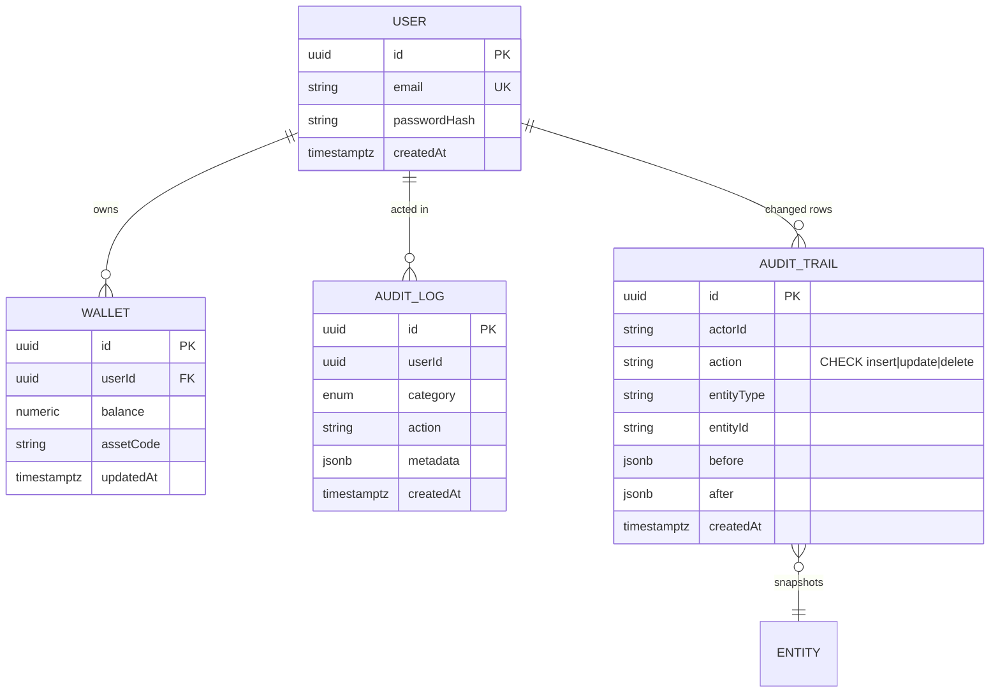

# Data Persistence & Database Module

How InterChangableTrade-Core persists data: connection management, transactions,
repositories, migrations, auditing, and operational guarantees.

## Components

| Piece | Location | Purpose |
| --- | --- | --- |
| Connection & pooling | `src/config/database.config.ts` | PostgreSQL options built from validated env config (`DB_POOL_MAX`, `DB_POOL_MIN`, idle timeout). |
| ACID transaction helper | `libs/common/src/database/transaction.helper.ts` | `TransactionHelper.run(work, isolation?)` wraps `DataSource.transaction`; everything commits or rolls back together. |
| Base repository | `libs/common/src/database/base.repository.ts` | `BaseRepository<T>.findPaginated()` returns the shared `PaginatedResultDto` envelope with clamped page/limit. |
| Versioned migrations | `src/database/migrations/` + `src/database/data-source.ts` | TypeORM CLI migrations; run via `npm run migration:run|revert|generate`. `DB_MIGRATIONS_RUN=true` applies pending migrations on boot. |
| Audit trail entity | `src/database/entities/audit-trail.entity.ts` | Append-only row-level change capture (`actorId`, `action`, `before`, `after`) with CHECK constraint on `action`. |
| Change-capture subscriber | `src/database/audit-trail.subscriber.ts` | Global TypeORM subscriber writing trail rows using the event's transaction manager; skips itself and swallows its own failures. |
| Actor binding | `src/database/audit-context.ts`, `src/database/actor-context.interceptor.ts` | `AsyncLocalStorage` carries the request user to the subscriber without signature changes. |

The activity/event log in `src/modules/audit` (who called which endpoint) is
complementary to the row-level trail here (which row changed and how).

## Entity relationship overview

## Indexing strategy

- **Composite indexes follow query patterns**: `(entityType, entityId, createdAt)`
  serves "history of this row", `(actorId, createdAt)` serves "what did this user
  change". Column order matches equality-first, range-last.
- **Hot filters get indexes** (`action`, `userId`) but every index slows writes;
  audit tables are write-heavy, so avoid speculative single-column indexes on
  low-cardinality columns.
- **JSONB snapshots are not indexed** by default; if diffing becomes a workload,
  add GIN indexes on specific keys rather than whole documents.
- Verify with `EXPLAIN (ANALYZE, BUFFERS)` before adding; monitor
  `pg_stat_user_indexes` for unused indexes.

## Backup & disaster recovery

Targets: **RPO < 5 minutes**, **RTO < 15 minutes**.

1. **Continuous WAL archiving** (PostgreSQL `archive_command` or a managed
   equivalent such as Cloud SQL PITR / RDS automated backups) gives a
   point-in-time recovery window measured in seconds-to-minutes → satisfies RPO.
2. **Nightly base backups** (`pgBackRest` full/incremental) retained 30 days,
   plus weekly restore drills into staging.
3. **Recovery runbook**: promote latest base backup + replay WAL to just before
   failure (≈5–10 min for a database of our size class); DNS/connection-string
   cutover to the restored instance (≈2 min); app pods reconnect via pooled
   retry logic already present in TypeORM. Total stays under the 15-minute RTO.
4. **Audit data durability**: `audit_trails` is append-only and small per row;
   it is included in the same backup chain. For stricter guarantees, stream
   inserts to an append-only sink (object storage / second region) as well.
5. Quarterly game-day: failover to warm standby replica; replication lag alarm
   at >60s protects the RPO budget.

## Sharding strategy

Current scale does not require sharding; the plan below is the agreed path when
write volume demands it:

- **Tenant/region-first**: partition by `userId` hash at the application layer
  (a thin datasource router keyed off the JWT claim). Most queries are
  user-scoped (wallets, trades), so they hit exactly one shard.
- **Shard key choice**: `userId`, never auto-increment ids or timestamps —
  avoids hot shards and keeps cross-shard joins rare.
- **Cross-shard operations**: escrow/trading flows that must touch two users'
  rows use saga-style compensation instead of 2PC; each leg is a local ACID
  transaction via `TransactionHelper`.
- **Audit trails**: shard by `entityId` hash; they are written where the change
  happened and read per-entity, so co-location preserves the access pattern.
- **Migration path**: start with PostgreSQL declarative partitioning
  (`PARTITION BY HASH (userId)`) on the largest tables (trades, ledger entries)
  — it delivers most of the benefit with no application changes — before moving
  to true multi-instance sharding.
